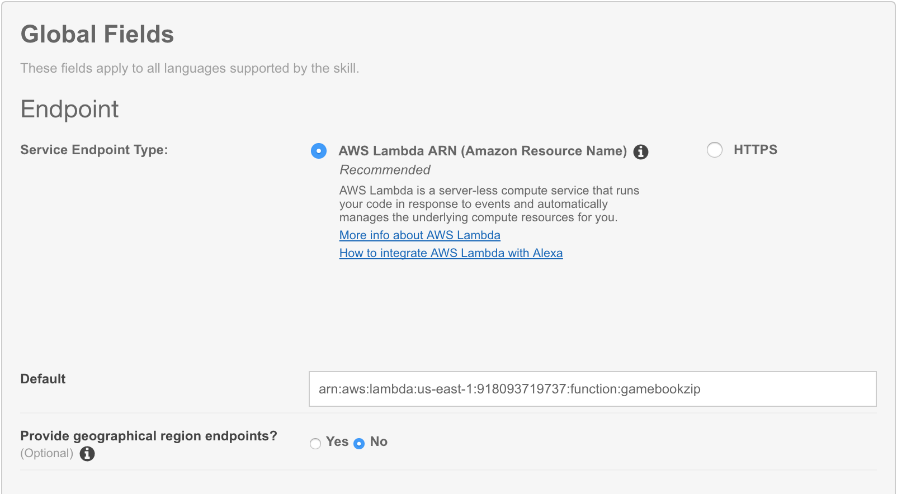

# Build An Alexa Gamebook Skill

## Connecting Your Voice User Interface To Your Lambda Function

On [page 1](./1-voice-user-interface.md) of this guide, we created a **Voice User Interface (VUI)** for the intents and utterances we expect from our users.  On [page 2](./2-lambda-function.md), we created a Lambda function that contains all of our logic for the skill.  On this page, we need to connect those two pieces together.

1.  Go back to the **[Amazon Developer Portal](https://developer.amazon.com/edw/home.html#/skills/list)** and select **your skill** from the list.

2.  Open the **Configuration** tab on the left side.

    

3.  Select a Service Endpoint Type of **AWS Lambda ARN (Amazon Resource Name)**. You have the ability to host your code anywhere that you would like, but for the purposes of simplicity and frugality, we are using AWS Lambda. (Read more about [Hosting Your Own Custom Skill Web Service](https://developer.amazon.com/public/solutions/alexa/alexa-skills-kit/docs/developing-an-alexa-skill-as-a-web-service).)  With the AWS Free Tier, you get 1,000,000 free requests per month, up to 3.2 million seconds of compute time per month. Learn more at https://aws.amazon.com/free/.  Amazon also offer [AWS Promotional Credits for developers](https://developer.amazon.com/alexa-skills-kit/alexa-aws-credits) who incur AWS costs with live Alexa skills.

    

4.  Go to your Lambda in the [AWS Lambda Console](https://eu-west-1.console.aws.amazon.com/lambda/home#/functions) and select your function to find the ARN. If you don't see you function check that you are in the right region in the top-right region dropdown. Paste your **Lambda's ARN (Amazon Resource Name)** into the **Default** text box. It should look similar to the screenshot above. Click **Save**.

5.  Leave **Provide geographical region endpoints?** as **No**. In the future you could host US and Europe versions near to your end users.

6.  Leave **Account Linking** set to **No**. Learn more about [Linking an Alexa User with a User in Your System.](https://developer.amazon.com/public/solutions/alexa/alexa-skills-kit/docs/linking-an-alexa-user-with-a-user-in-your-system)

7.  Click the **Next** button to continue to page 4 of this guide.

    

  

